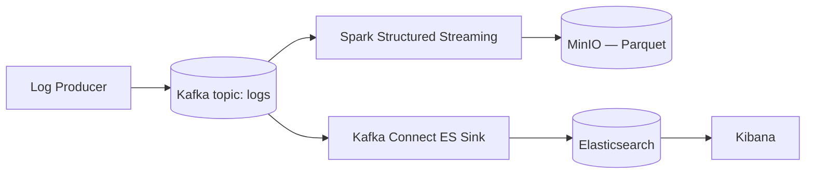

[](https://github.com/Suhasrv2403/RealTimeLogAnalytics/actions/workflows/ci.yml)

# Real-Time Log Analytics Pipeline

A containerized, real-time log analytics pipeline: synthetic application
logs flow through Kafka into two parallel consumers — Spark Structured
Streaming writes them to MinIO as Parquet for analytics, and Kafka Connect
indexes them into Elasticsearch for search and Kibana dashboards. Every
setting (topics, credentials, intervals, jar versions) is centralized in
one config file instead of hardcoded across scripts, and the whole stack
comes up with a single `docker compose` command.

**Stack:** Apache Kafka · Apache Spark (Structured Streaming) · MinIO (S3-compatible) · Kafka Connect · Elasticsearch · Kibana · Docker Compose · Python · pytest

## Why this matters

Every production system generates logs, and the moment a team needs to
both search them in real time *and* run analytics/cost queries over them
later, they need two different storage shapes from the same event stream
— without double-producing or double-processing. This project is that
fan-out pattern in miniature: one durable event log, two independent
consumers, neither blocking the other. The same shape shows up anywhere a
team needs "search this now" and "analyze this over months" from a single
source of truth — application logs, clickstream events, IoT telemetry.

## Architecture



Both consumers read the same topic independently from `earliest`, so
either can be stopped and restarted without affecting the other. See
[docs/DETAILS.md](docs/DETAILS.md) for the full rationale.

## How to run

```bash
git clone https://github.com/yourusername/log-analytics-pipeline.git
cd log-analytics-pipeline

# 1. Start the stack (Kafka, Spark, MinIO, Elasticsearch, Kibana, Kafka Connect)
docker compose up -d --build

# 2. Create the Kafka topic
python scripts/kafka/create_topic.py

# 3. Deploy the Elasticsearch sink connector
sh scripts/deploy_connectors.sh

# 4. Start generating logs
pip install -r requirements.txt
python scripts/kafka/log_generator.py
```

All settings above (broker addresses, topic name, MinIO credentials, the
producer's RNG seed, Spark's trigger interval, jar versions) live in
[configs/pipeline.env](configs/pipeline.env) — override any of them by
exporting the variable before running a script, no code changes needed.

**Verify it's working:**
- MinIO console at [http://localhost:9001](http://localhost:9001) — check `logs/parquet_logs/`
- Elasticsearch: `curl http://localhost:9200/logs/_search?pretty`
- Kibana at [http://localhost:5601](http://localhost:5601) — create an index pattern for `logs*`

**Run the tests:**
```bash
pip install pytest ruff
ruff check .
pytest
```

## At scale

This runs as a single-broker, single-partition Kafka cluster with no
persistent streaming checkpoint volume — fine for a demo, not for
production. Scaling it up means: a multi-broker Kafka cluster with the
topic's partition count and replication factor raised accordingly (both
are already config values, not hardcoded), a persistent volume for
Spark's checkpoint directory so exactly-once semantics survive a
container restart, and moving MinIO credentials out of a tracked config
file and into a real secrets manager. See
[docs/DETAILS.md](docs/DETAILS.md#known-limitations) for the full list.

## Repo structure

```
src/                     # core processing logic
  spark/log_consumer.py    # Structured Streaming job: Kafka -> console + MinIO
  common/env_config.py      # shared config-file loader
scripts/                 # entry-point / CLI scripts
  kafka/create_topic.py     # one-shot: create the Kafka topic
  kafka/log_generator.py    # synthetic log producer
  deploy_connectors.sh       # deploys the Kafka Connect ES sink
tests/                   # pytest unit tests
configs/                 # pipeline.env (settings) + connector JSON
data/                    # tracked sample log records
results/                 # placeholder for exported pipeline output
docs/                    # DETAILS.md — deep-dive, limitations, references
docker/                  # Dockerfiles for the spark and kafka-connect images
docker-compose.yml       # orchestrates the full stack
```

## License

[MIT](LICENSE)
